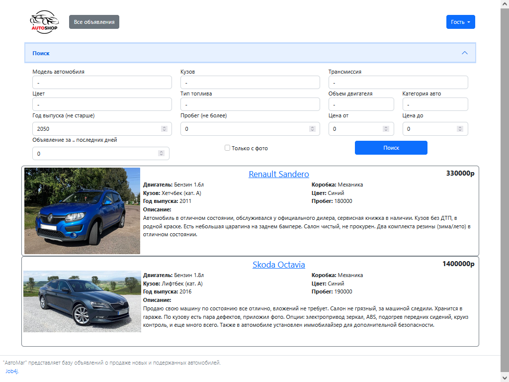
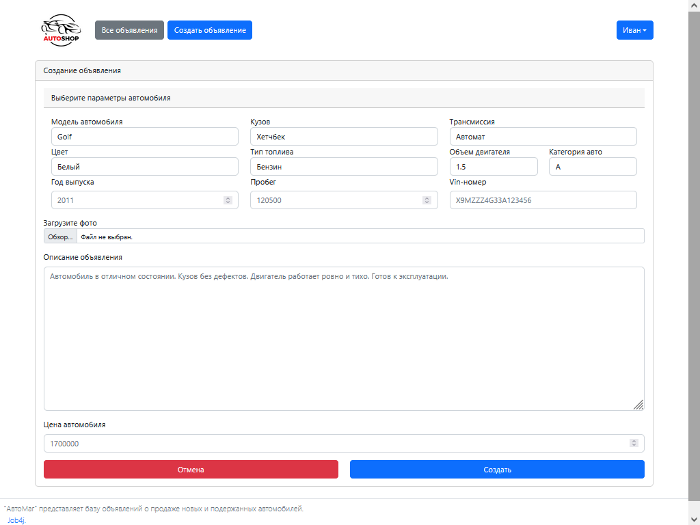
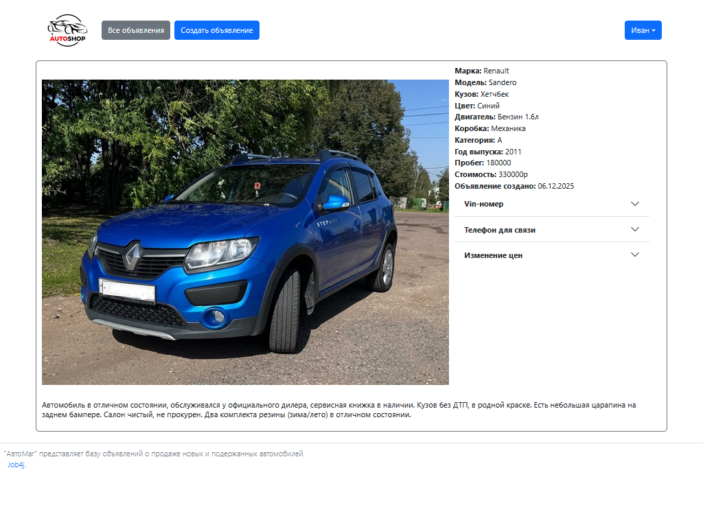
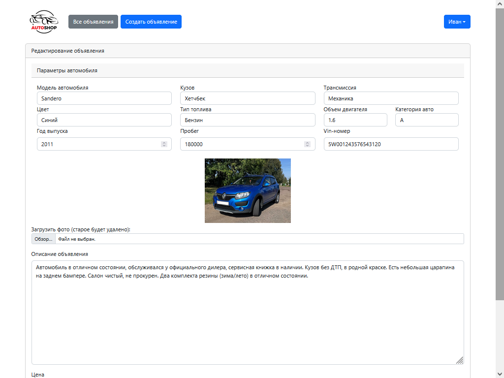
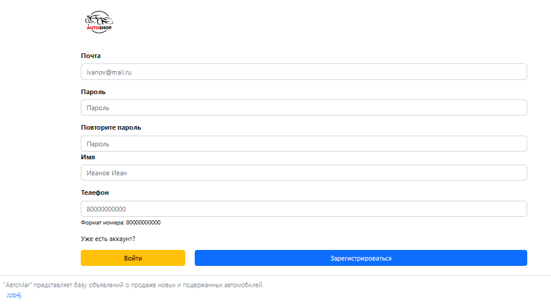
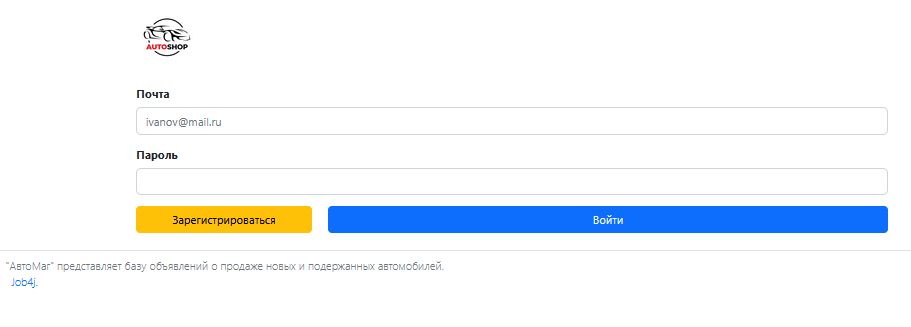
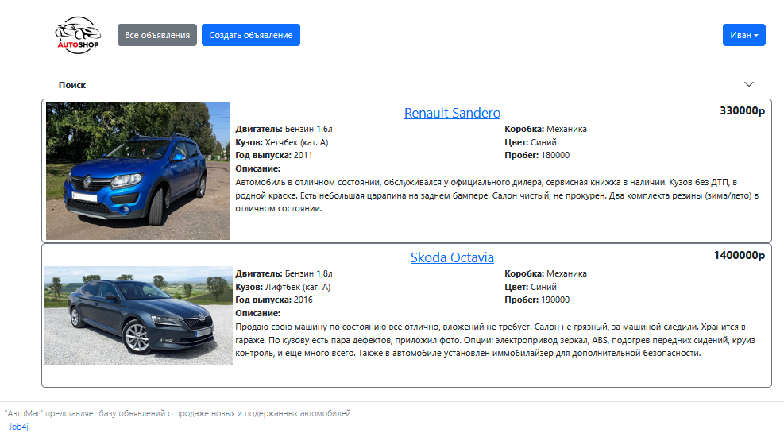
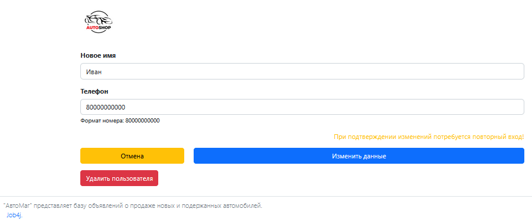

## job4j_cars

Это приложение - сервис для размещения объявлений по продаже автомобилей.

Функциональные возможности приложения включают в себя регистрацию и авторизацию пользователей, просмотр объявлений о продаже машин (как списком, так и по отдельности), возможность добавления и редактирования объявлений зарегистрированными пользователями. Поиск объявлений реализован на основе Criteria API.

Исходные данные для моделей автомобилей, типов кузова, коробок передач и других ключевых элементов предварительно загружены в базу данных. Эти данные импортируются при сборке проекта с использованием Liquibase, который развертывает соответствующие SQL-скрипты, расположенные в директории db/scripts.

### Используемые технологии:
<b>Java 18</b> - версия языка программирования Java </br>
<b>Spring boot</b> - фреймворк для разработки приложений на языке Java </br>
<b>Maven</b> - инструмент для автоматической сборки проектов </br>
<b>Tomcat</b> - контейнер сервлетов с открытым исходным кодом </br>
<b>Liquibase</b> - инструмент для управления версиями базы данных и автоматизации процессов миграции схемы данных </br>
<b>JUnit</b> - фреймворк для модульного тестирования ПО </br>
<b>Mockito</b> - библиотека для создания фиктивных объектов (моков) в тестах </br>
<b>Thymeleaf</b> -  шаблонизатор Java на стороне сервера </br>
<b>PostgreSQL</b> - объектно-реляционная СУБД </br>
<b>H2</b> - СУБД для тестирования </br>

### Запуск проекта:
```
1. Скопировать проект из этого репозитория;
2. Создать локальную базу данных "cars";
3. Добавить логин и пароль к соз****данной базе данных в ресурсные файлы 
db/liquibase.properties и resorces/hibernate.cfg.xml;
4. Запустить liquibase для предварительного создания таблиц;
5. Запустить приложение через класс Main, находящийся в папке src\main\java\ru\job4j\cars;
6. Открыть в браузере страницу http://localhost:8080/index;

```
### Доступные страницы:
**Главная страница с открытой формой поиска и списком объявлений:**


**Форма для создания нового объявления (для зарегистрированных пользователей):**


**Страница объявления с подробным описанием автомобиля:**


**Форма для редактирования объявления (доступно зарегистрированным пользователям):**


**Регистрация пользователя:**


**Авторизация:**


**Список объявлений пользователя:**


**Страница с возможностью отредактировать данные пользователя:**



### Контакты:
>     Telegram: https://t.me/AlexKrmv


